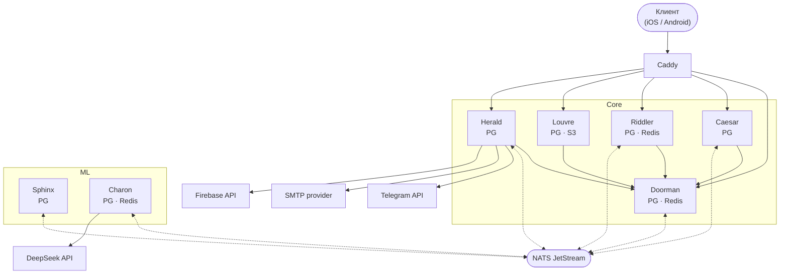

# edium-backend

Серверная часть Edium - Микросервисы + ML-пайплайн.

## Архитектура

> Пунктир — асинхронные события через NATS

> Сплошная - синхронные запросы

## Сервисы

| Сервис | Описание                                    |
|--------|---------------------------------------------|
| **Doorman** | Аутентификация: OTP, JWT (access + refresh) |
| **Caesar** | Пользователи, классы, курсы, модули         |
| **Riddler** | Квизы, сессии прохождения, результаты       |
| **Herald** | Уведомления, email (SMTP), Telegram bot, SMS |
| **Charon** | Прокси к LLM (DeepSeek / OpenAI)            |
| **Sphinx** | Генерация квизов по тексту (Python + LLM)   |
| **Louvre** | Хранение изображений                        |
