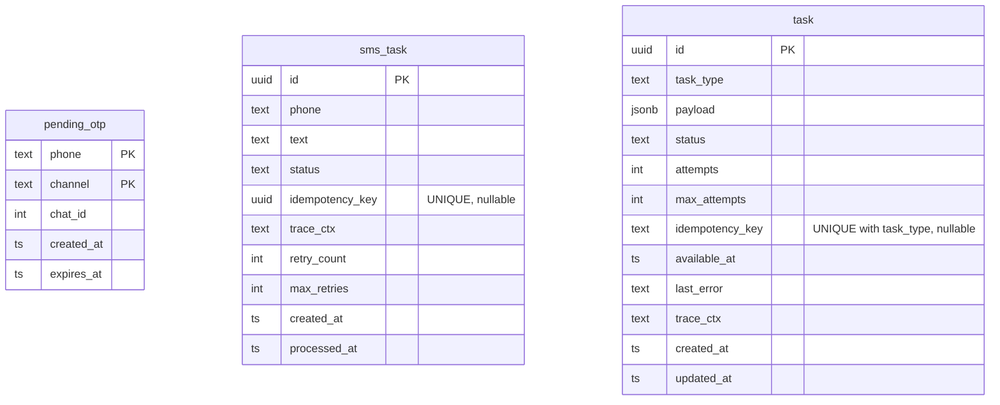

# Herald — схема данных

## База данных

`pending_otp.channel` — строковое поле: `tg`, `sms`.

`sms_task.status` — строковое поле: `pending`, `sent`.

Email uses `task.task_type = email_delivery`. Its payload contains one recipient,
subject, plain-text body and optional HTML body. The `(task_type,
idempotency_key)` partial unique index prevents duplicate enqueue calls. Recipient
and message content are not copied into technical logs.
